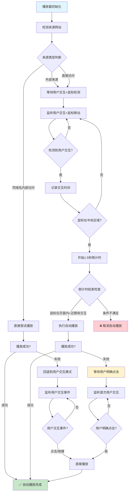
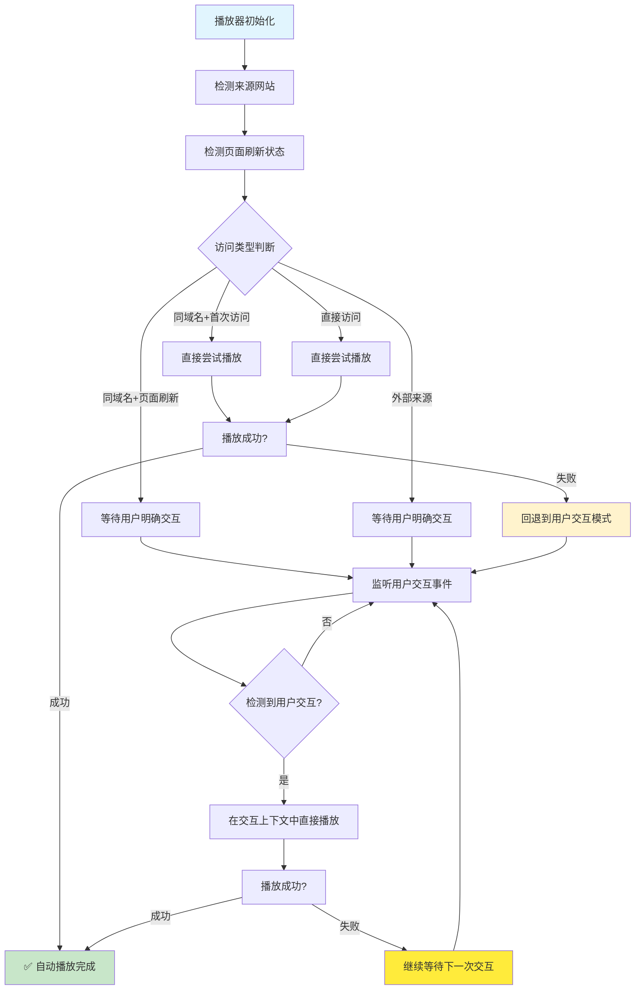

# 自动播放流程图

## 🖥️ 桌面端自动播放流程



## 📱 移动端自动播放流程



## 📊 核心流程说明

### 🖥️ 桌面端自动播放机制

**入口检测逻辑**
- **同域名访问**: 直接尝试播放，失败则回退到用户交互模式
- **外部来源**: 必须等待用户交互和鼠标检测
- **直接访问**: 同外部来源处理

**交互检测要求**
- **用户交互检测**: 监听 click、mousedown、keydown、scroll、wheel 等事件
- **鼠标位置检测**: 鼠标必须进入页面中央区域（距离边界10%范围内）
- **倒计时机制**: 鼠标进入中央区域后开始1.5秒倒计时
- **双重验证**: 倒计时结束时验证鼠标仍在页面内且2秒内有近期交互

**失败处理策略**
- 播放失败时回退到等待用户明确点击
- 设置一次性事件监听器，用户点击时直接播放

### 📱 移动端自动播放机制

**页面刷新检测**
- 使用 `performance.getEntriesByType('navigation')` 检测导航类型
- 备用方案：使用 `sessionStorage` 标记访问状态
- 区分 `reload`、`back_forward` 和首次加载

**差异化处理**
- **首次访问（同域名/直接）**: 直接尝试播放
- **页面刷新**: 必须等待用户明确交互
- **外部来源**: 必须等待用户明确交互

**用户交互处理**
- **真实上下文播放**: 在用户交互事件的回调中直接调用 `audio.play()`
- **触摸事件支持**: 额外监听 `touchstart` 事件
- **持续监听**: 播放失败时不移除监听器，继续等待下一次交互

### 🔧 技术实现细节

**页面刷新检测方法**
```javascript
isPageRefresh() {
    // 优先使用 Performance API
    if (window.performance && window.performance.getEntriesByType) {
        const navigationEntries = window.performance.getEntriesByType('navigation');
        if (navigationEntries.length > 0) {
            const navigationType = navigationEntries[0].type;
            return navigationType === 'reload' || navigationType === 'back_forward';
        }
    }
    
    // 备用：SessionStorage 检测
    const hasVisited = sessionStorage.getItem('netease_player_visited');
    if (hasVisited) {
        return true; // 已访问过，说明是刷新
    }
    sessionStorage.setItem('netease_player_visited', 'true');
    return false;
}
```

**用户交互上下文播放**
```javascript
// 移动端：在真实用户交互事件中直接播放
const handleUserInteraction = async (event) => {
    try {
        await this.audio.play(); // 直接在事件上下文中播放
        this.isPlaying = true;
        // 播放成功后移除监听器
    } catch (error) {
        // 失败时继续等待下一次交互
    }
};
```

## 🔄 核心状态变量详解

| 变量名 | 类型 | 作用 | 适用平台 | 生命周期 |
|--------|------|------|----------|----------|
| `hasUserInteraction` | Boolean | 是否检测到任何用户交互 | 桌面端 + 移动端 | 首次交互后为true |
| `mouseInCenterArea` | Boolean | 鼠标是否在页面中央区域 | 仅桌面端 | 鼠标移动时动态更新 |
| `mouseInDocument` | Boolean | 鼠标是否在页面窗口内 | 仅桌面端 | 鼠标进出窗口时更新 |
| `autoplayAttempted` | Boolean | 是否已尝试过自动播放 | 桌面端 + 移动端 | 成功播放后为true |
| `lastInteractionTime` | Number | 最后一次用户交互的时间戳 | 桌面端 + 移动端 | 每次交互时更新 |
| `lastInteractionEvent` | Event | 最后一次交互事件对象 | 桌面端 + 移动端 | 每次交互时更新 |
| `autoplayTimer` | Number | 自动播放倒计时器ID | 仅桌面端 | 倒计时启动时设置 |
| `userInteractionHandler` | Function | 用户交互处理函数引用 | 桌面端 + 移动端 | 等待交互时设置 |
| `resourcesLoaded` | Boolean | 资源是否完全加载 | 桌面端 + 移动端 | 资源加载完成后为true |

## ⚙️ 关键配置参数

| 参数 | 默认值 | 说明 | 影响范围 |
|------|--------|------|----------|
| `autoplay` | false | 是否启用自动播放功能 | 全局开关 |
| `embed` | false | 是否为嵌入模式（自动禁用自动播放） | 全局禁用 |
| `mouseReturnDelay` | 1500ms | 桌面端鼠标进入中央区域后的等待时间 | 仅桌面端 |
| `recentInteractionThreshold` | 2000ms | 桌面端近期交互检测时间窗口 | 仅桌面端 |
| `idleDelay` | 5000ms | 播放器空闲淡出延迟时间 | UI效果 |

## 🎯 核心决策树

### 桌面端决策流程
```
 autoplay: true?
        |
        v
 isEmbed: false?
        |
        v
{referralType}
    internal -> 尝试直接播放 -> 失败? -> 等待用户交互
    external  -> 等待用户交互 + 鼠标中央区域检测
    direct    -> 同external
        |
        v
{hasUserInteraction: true}
        |
        v
{mouseInCenterArea: true} -> 1.5秒倒计时 -> {mouseInDocument: true} + {2秒内有交互} -> 播放
```

### 移动端决策流程
```
 autoplay: true?
        |
        v
 isEmbed: false?
        |
        v
{isPageRefresh}
    false  -> {referralType: internal/direct} -> 尝试直接播放 -> 失败? -> 等待用户交互
    true   -> 等待用户明确交互 -> 在事件上下文中播放
    unknown -> 同true（默认保守策略）
```

## 🚀 性能优化要点

### 事件监听优化
- **被动监听**: 使用 `{ passive: true }` 减少主线程阻塞
- **捕获阶段**: 关键交互检测使用 `{ capture: true }` 确保优先级
- **一次性监听**: 播放成功后自动移除相关监听器

### 内存管理
- **定时器清理**: 页面隐藏或组件销毁时清除所有定时器
- **事件移除**: 提供 `removeUserInteractionListeners` 统一清理
- **引用保存**: 避免匿名函数导致的内存泄漏

### 兼容性考虑
- **Performance API**: 优先使用，不可用时回退到 SessionStorage
- **触摸事件**: 移动端额外监听 `touchstart` 确保响应性
- **渐进增强**: 优先尝试最佳体验，失败时回退到保守策略

## 🔍 调试指南

### 关键日志节点
1. **来源检测**: `🔗 来源网站检测: {domain}`
2. **页面刷新**: `检测到移动端页面刷新，需要用户交互后才能播放`
3. **用户交互**: `检测到用户交互: {event.type}`
4. **鼠标区域**: `鼠标进入/离开中央区域`
5. **播放尝试**: `检测到{reason}，直接进行播放`
6. **播放结果**: `{reason}自动播放成功/失败`

### 常见问题排查
| 问题现象 | 可能原因 | 解决方案 |
|----------|----------|----------|
| 移动端刷新后无法播放 | 页面刷新检测失败 | 检查 Performance API 支持 |
| 桌面端不自动播放 | 鼠标未进入中央区域 | 调整中央区域检测逻辑 |
| 重复播放提示 | `autoplayAttempted` 状态异常 | 检查状态重置时机 |
| 事件监听器堆积 | 清理逻辑缺失 | 确保播放成功后移除监听器 |

---

、